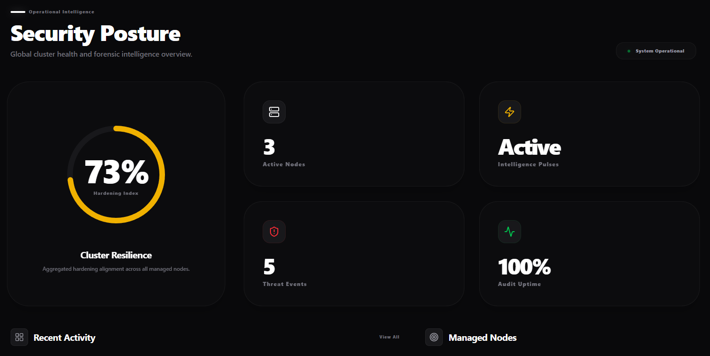

# Companion Sentinel: Enterprise Security Intelligence (v1.0.0)

Companion Sentinel is a cloud-native, intelligence-driven infrastructure security platform designed for real-time threat monitoring and automated remediation. Built for modern DevOps and SecOps teams, Companion Sentinel provides high-fidelity auditing across your entire fleet with zero inbound firewall overhead.

**[Live Dashboard](https://the-companion.com/)** | **[Interactive API Documentation](https://the-companion.com/api-docs)**

---

## Enterprise-Grade Protection
Sentinel provides deep visibility into your infrastructure integrity, enabling automated response to sophisticated threats.

### 1. Multi-Layered Auditing & Forensics
*   **Framework Audit**: React Server Components (RSC) zero-day detection logic.
*   **XDR Detection Blades**: behavioral sensors including Ransomware Encryption Patterns, Shell Escapes, and Kernel Module Insertion.
*   **Binary Auditing**: Real-time CVE scanning against official security feeds.
*   **CIS Benchmarking**: Hardening audits based on industry-standard Linux benchmarks.
*   **Asset Inventory**: Deep metadata collection (Open Ports, Active Services, Kernel Architecture).

### 2. Companion Sentinel AI Engine
*   **Context-Aware Fixes**: AI analyzes specific system metadata to generate precise, idempotent remediation paths.
*   **Hybrid Intelligence**: Seamless integration with managed token pools or Bring Your Own Key (BYOK).

### 3. Developer Ecosystem
*   **RESTful Public API**: 100% data transparency via Node Inventory and Forensic endpoints.
*   **Universal Webhooks**: Native support for Slack, Discord, and Telegram.

---

## Public Interaction
This repository serves as the official public hub for Companion Sentinel.

*   **[Log a Bug](https://github.com/BrandenNaidoo/Companion-Sentinel-Public/issues)**
*   **[Request a Feature](https://github.com/BrandenNaidoo/Companion-Sentinel-Public/issues)**
*   **[View Roadmap](https://github.com/BrandenNaidoo/Companion-Sentinel-Public/projects)**

---
**Companion Sentinel** - *Infrastructure security visibility at the speed of thought.*
