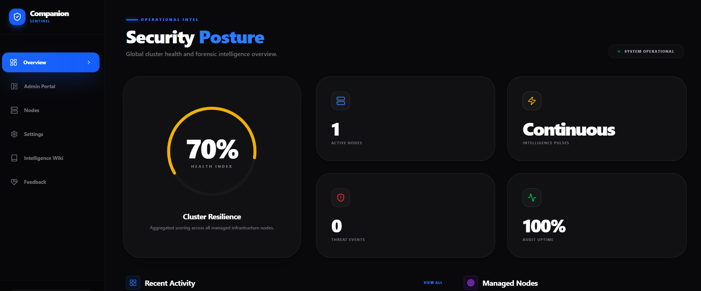
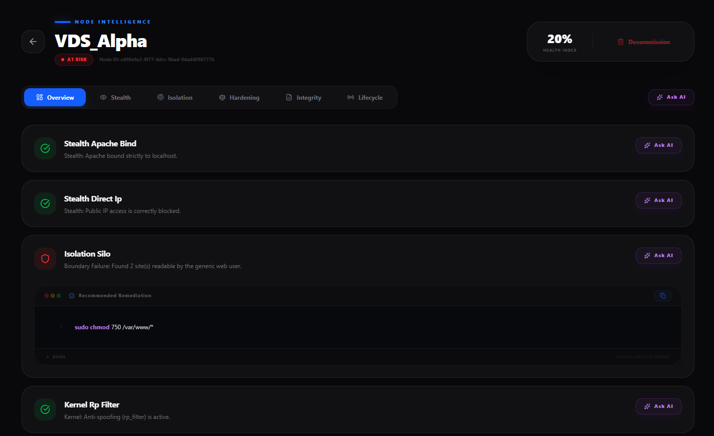
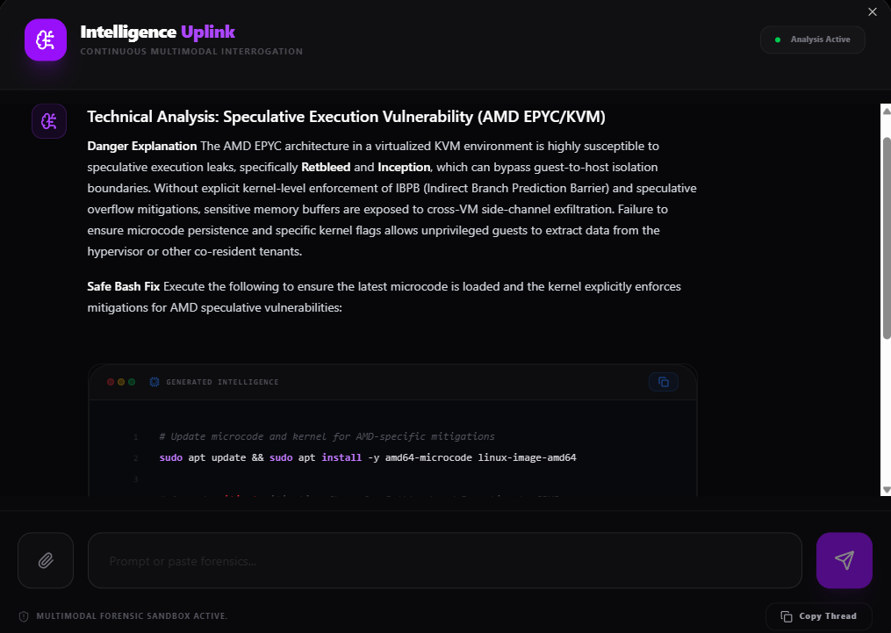

# 🛡️ Companion Sentinel: Public Intelligence Hub
> **Next-gen security command plane for proactive origin forensics and AI-native infrastructure hardening.**

---

## 🚀 Mission Control
**Companion Sentinel** provides a single, high-fidelity source of truth for your entire server fleet. Our "Mission Control" aesthetic is designed for instant technical situational awareness.

  

---

## 🧠 Intelligence Layer
Our proprietary agent executes deep technical audits that go beyond standard application-level security:

### 1. WordPress Origin Forensics
*   **Zero-Trust Malware Discovery**: Proactively scans the `wp-content` hierarchy for high-risk PHP patterns (`eval`, `base64_decode`) hidden within security plugins.
*   **Hidden Backdoor Detection**: Audits the filesystem for suspicious hidden files used for persistent web-shell access.

  

### 2. Multimodal AI Interrogation
*   **Forensic Vision**: Paste terminal screenshots or log artifacts directly into the Mission Control center for instant visual analysis.
*   **Interrogative Chat**: A multi-turn AI protocol allowing operators to iteratively refine remediation scripts.

  

---

## 🔒 Security & Sovereignty
Built on a **Zero-Knowledge Mesh**, Companion Sentinel ensures your technical secrets are impenetrable:
*   **Encrypted Tunnels**: All telemetry is pushed via **TLS 1.3**; no inbound ports required.
*   **Secrets Isolation**: User-provided AI keys are cryptographically locked using **AES-256-GCM**.
*   **One-Way Identification**: Personal Access Tokens (PAT) are stored exclusively as secure **SHA-256 hashes**.

---

## ⚡ Community Interaction
Use this repository's **Issue Tracker** to help refine the sentinel intelligence feed:

*   **[Log a Technical Issue](https://github.com/BrandenNaidoo/Companion-Sentinel-Public/issues/new)**: Found a bug in the agent or dashboard?
*   **[Request Forensic Signature](https://github.com/BrandenNaidoo/Companion-Sentinel-Public/issues/new?title=[Signature+Request]+)**: Request detection for a specific CVE or malware pattern.
*   **[Technical Wiki](https://the-companion.com/docs)**: Read the full Technical Manual.

---

## 🌎 Enterprise Marketplace
Ready to build a proactive security mesh?
**[Initiate Production Deployment →](https://the-companion.com)**

&copy; 2025 Companion Sentinel. All Rights Reserved.
